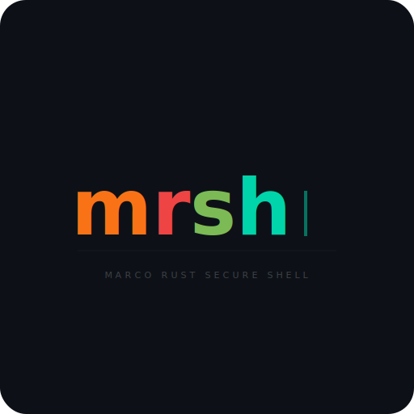

<p align="center">
  
</p>

<h1 align="center">mrsh</h1>
<h3 align="center"><b>M</b>arco <b>R</b>ust <b>S</b>ecure s<b>H</b>ell &mdash; <i>sounds like marsh, marches like Marsch</i></h3>

<p align="center">
  SSH had a good run. Time to march forward.<br>
  One binary to rule them all. TLS-encrypted. Delta-sync transfers. Fleet management built in.
</p>

<p align="center">
  <a href="#features">Features</a> &middot;
  <a href="#quick-start">Quick Start</a> &middot;
  <a href="#usage">Usage</a> &middot;
  <a href="#building">Building</a> &middot;
  <a href="#security">Security</a>
</p>

---

## Why mrsh?

Because `ssh` was designed in 1995 when "fleet management" meant horses, and the old `rsh` (1983) was about as secure as a screen door on a submarine. **mrsh** is what happens when you rebuild remote management from scratch in Rust, with opinions:

- **Delta-sync transfers** &mdash; rsync-like CDC chunking, only changed blocks travel over the wire (up to 97% bandwidth savings)
- **Unified binary** &mdash; one `mrsh` executable works as client, server, Windows service, and system tray app
- **SSH compatibility** &mdash; auto-detects SSH on the same port (peek first byte: `0x16`=TLS, `0x53`=SSH)
- **Persistent sessions** &mdash; ConPTY + ring buffer, detach and reattach from any client
- **NAT traversal** &mdash; built-in rendezvous relay for machines behind firewalls
- **GUI automation** &mdash; mouse, keyboard, window control over the wire
- **Remote GUI testing** &mdash; built for automated UI testing on remote machines (screenshot, click, type, verify)
- **AI-friendly** &mdash; designed for AI agent orchestration with built-in safety guards

## Features

| Category | Capabilities |
|----------|-------------|
| **Connection** | TLS 1.3, ed25519 auth, TOTP 2FA, SSH-style TOFU, multiplexed channels, ProxyJump (`-J`), zstd compression |
| **File Transfer** | CDC delta-sync, bidirectional `sync-dir` (mtime+size), `.syncignore`, block cache, hash cache, batch pipeline, SCP server, `--checksum`, `--backup`, `--bwlimit`, `--progress` with ETA, relay push |
| **Shell** | Persistent ConPTY sessions, multi-client attach, tilde-escape commands, session recording (asciicast export) |
| **Execution** | Remote PowerShell exec, batch scripting (`.mrsh` files), SOCKS5 proxy (`-D`), `--timeout` flag |
| **GUI** | Mouse control, keyboard input, window management, screen capture (MJPEG), multi-display, remote UI test automation |
| **System** | `reboot`, `shutdown`, `sleep`, `lock`, `wake` (WoL), `info`, `service` management, `ps`/`kill` |
| **Server** | Windows service (SCM), system tray with notifications, console mode, auto-tray launch (WTS), DLL plugins |
| **Fleet** | Multi-host status, rendezvous relay, hbbs peer discovery, LAN discovery, self-update, fleet enrollment, `install-pack` (NSIS) |
| **Dashboard** | TUI fleet dashboard (`mrsh dash`), TUI log viewer (`mrsh log`), real-time status with action menu |
| **Network** | NAT type detection (STUN), bidirectional clipboard sync, LAN peer discovery broadcast |
| **Config** | SSH-style config file, Ratatui TUI editor, TUI host picker (fuzzy search), auto-DeviceID, `--log-file` |
| **SSH** | Transparent SSH fallback, SFTP, agent forwarding (`-A`), local/reverse port forwarding (`-L`/`-R`) |
| **Security** | Per-key permissions (no-exec, no-gui, no-reboot, no-clipboard, no-screenshot), rate limiting |

## Quick Start

### Client (Linux/macOS/Windows)

```bash
# Test connection (auto-tries ports 8822, 9822, 22)
mrsh -h 192.168.1.100 ping

# Interactive shell
mrsh -h 192.168.1.100 shell

# Execute command
mrsh -h 192.168.1.100 exec "Get-Process"

# Push files (delta-sync)
mrsh -h 192.168.1.100 push ./src C:\app\src

# Pull files
mrsh -h 192.168.1.100 pull C:\logs\app.log ./local/

# Bidirectional sync (newer wins)
mrsh -h 192.168.1.100 sync-dir ./project C:\project
```

### Server (Windows)

```powershell
# Install as Windows service
.\mrsh.exe --install
net start mrsh

# Or run as tray icon
.\mrsh.exe
```

## Usage

### File Transfer

```bash
# Delta-sync push (only changed blocks transfer)
mrsh -h host push ./project C:\deploy\project

# With exclusions
mrsh -h host -x '*.log' -x 'node_modules' push ./src C:\app\src

# Dry-run (see what would change)
mrsh -h host --dry-run push ./data C:\backup

# With checksum verification
mrsh -h host --checksum push ./data C:\backup

# Mirror mode (delete remote files not present locally)
mrsh -h host --delete push ./src C:\app\src

# Bandwidth limit
mrsh -h host --bwlimit 1024 push ./large-file.bin C:\data\
```

### Shell Sessions

```bash
# Start persistent session
mrsh -h host shell

# Reattach to existing session
mrsh -h host attach <session-id>

# List active sessions
mrsh -h host sessions list

# Kill a session
mrsh -h host sessions kill <session-id>

# Tilde-escape commands (inside session):
#   ~.  detach
#   ~u  upload file
#   ~d  download file
#   ~?  help
```

Sessions persist on the server. Detach with `~.` and reattach later from any client.

### Session Recording

```bash
# List recordings
mrsh -h host recording list

# Export to asciicast format (for asciinema playback)
mrsh -h host recording export <session-id> output.cast
```

### Remote Execution

```bash
mrsh -h host exec "Get-Service | Where Status -eq Running"
mrsh -h host ps                        # List processes
mrsh -h host kill 1234                 # Kill process
mrsh -h host ls C:\logs                # List directory
mrsh -h host cat C:\logs\app.log       # Read file

# With timeout (kills command after N seconds)
mrsh -h host --timeout 30 exec "long-running-command"
```

### System Control

```bash
mrsh -h host reboot                    # Reboot remote machine
mrsh -h host reboot -f                 # Force reboot (no graceful shutdown)
mrsh -h host shutdown                  # Shutdown remote
mrsh -h host sleep                     # Suspend/sleep remote
mrsh -h host lock                      # Lock workstation
mrsh -h host wake myserver             # Wake-on-LAN (uses MAC from config)
mrsh -h host status                    # Connection quality + host info
mrsh -h host info                      # Structured system info (JSON)
```

### Service Management

```bash
mrsh -h host service list              # List all services
mrsh -h host service status <name>     # Service status
mrsh -h host service start <name>      # Start service
mrsh -h host service stop <name>       # Stop service
mrsh -h host service restart <name>    # Restart service
```

### GUI Automation

```bash
# Mouse
mrsh -h host mouse move 500 300
mrsh -h host mouse click
mrsh -h host mouse click right

# Keyboard
mrsh -h host key type "Hello World"
mrsh -h host key tap enter
mrsh -h host key combo ctrl shift esc

# Windows
mrsh -h host window list
mrsh -h host window find "Notepad"
mrsh -h host window activate "Chrome"
```

### Batch Scripting

```bash
mrsh -h host -f commands.mrsh
```

```bash
# commands.mrsh
exec "Get-Date"
mouse move 500 300
mouse click
key type "automated input"
sleep 2000
exec "hostname"
echo "Done on: $_"
```

### Connection Multiplexing

```bash
# Start a control master (reuse connection for subsequent commands)
mrsh -h host -M exec "hostname"

# Subsequent commands reuse the existing connection (automatic)
mrsh -h host exec "Get-Date"

# Skip control socket for this command
mrsh -h host --no-mux exec "isolated-command"

# Stop control master
mrsh -h host --mux-stop
```

### ProxyJump

```bash
# Connect through a jump host
mrsh -h target -J jumphost exec "hostname"

# Jump host with custom port
mrsh -h target -J jumphost:9822 exec "hostname"
```

### Fleet Management

```bash
# Fleet status (probes all configured hosts + hbbs-discovered peers)
mrsh fleet status

# Interactive TUI dashboard (live refresh, Enter for action menu)
mrsh dash

# TUI log viewer (filter, search, tail mode)
mrsh log

# Update all outdated hosts (push binary + self-update)
mrsh fleet update

# Discover peers enrolled in a group
mrsh fleet discover --group myteam

# Create installer package with pre-configured connection
mrsh install-pack --server 192.168.1.100 --key ~/.ssh/id_ed25519.pub -o installer.exe
```

### SSH Compatibility

```bash
# Auto-detect: tries mrsh, falls back to SSH
mrsh -h host ping

# Force SSH
mrsh -h host --ssh exec "uname -a"

# SSH tunneling
mrsh -h host tunnel -L 8080:localhost:80

# Reverse port forwarding
mrsh -h host tunnel -R 9090:localhost:80

# SOCKS5 proxy
mrsh -h host tunnel -D 1080

# SSH agent forwarding
mrsh -h host -A shell
```

### NAT Traversal (Rendezvous)

```bash
# Connect via device ID (through relay)
mrsh -h 118855822 ping

# P2P and relay race in parallel — fastest wins
```

Configure in `~/.mrsh/config`:

```
RendezvousServer rdv.example.com:21116

Host myserver
    DeviceID 118855822
    Port 8822
```

### Self-hosted Relay

```bash
# Run your own rendezvous server (hbbs-compatible)
mrsh rendezvous --port 21116

# Run your own relay server (hbbr-compatible)
mrsh relay --port 21117
```

### File Watching

```bash
# Watch local directory and auto-push changes to remote
mrsh -h host watch ./src C:\app\src

# Useful for live development — changes sync automatically
```

### Screen Capture

```bash
mrsh -h host screen stream     # MJPEG live stream
mrsh -h host screen capture    # Single screenshot
```

## Configuration

SSH-style config file at `~/.mrsh/config`:

```
# Global defaults
RendezvousServer rdv.example.com:21116

# Per-host settings
Host myserver
    Hostname 192.168.1.100
    Port 8822                 # Explicit port (skips auto-try)
    MAC aa:bb:cc:dd:ee:ff    # For Wake-on-LAN
    DeviceID 118855822        # For relay connections
```

**Port resolution order**: (1) explicit `-p` flag, (2) config `Port` field, (3) auto-try 8822 → 9822 → 22 with 3s timeout per port.

### Server Configuration

Server files live in `C:\ProgramData\mrsh\`:

```
C:\ProgramData\mrsh\
├── mrsh.exe              # Binary (service + tray + client)
├── authorized_keys      # Ed25519 public keys (auto-reloaded)
├── server_key           # Auto-generated on first run
├── startup.bat          # Optional: runs at service start
├── plugins\             # Plugin DLLs
├── cache\               # Block cache (msgpack KV)
└── mrsh.log              # Server log
```

## Building

Requires Rust 1.85+ (edition 2024) and `x86_64-pc-windows-gnu` target for cross-compilation.

```bash
# Linux client
cargo build --release

# Windows client+server (cross-compile from Linux)
cargo build --release --target x86_64-pc-windows-gnu

# Run tests (539 tests on Linux, ~12s)
cargo test --workspace
```

Binaries are placed in `target/release/rsh` (~5.5 MB) and `target/x86_64-pc-windows-gnu/release/mrsh.exe` (~4.8 MB). Both are stripped with LTO enabled.

## Security

- **TLS 1.3** for all connections (self-signed certs with TOFU pinning)
- **Ed25519** challenge-response authentication (same key format as SSH)
- **TOTP 2FA** &mdash; optional per-key two-factor authentication
- **No passwords** &mdash; key-based auth only (ed25519)
- **Known hosts** &mdash; server certificate fingerprints are verified on first connect and pinned
- **Authorized keys** &mdash; hot-reloaded on every connection, no restart needed
- **Rate limiting** &mdash; IPs banned after 5 failed auth attempts within 60 seconds

### Generating Keys

mrsh has a built-in key generator (no OpenSSH required):

```bash
# Generate ed25519 key pair (default: ~/.mrsh/id_ed25519 + .pub)
mrsh keygen

# Generate to custom path
mrsh keygen /path/to/mykey

# Copy public key to server
mrsh -h host push ~/.mrsh/id_ed25519.pub C:\ProgramData\mrsh\authorized_keys
```

Standard SSH ed25519 keys (`ssh-keygen -t ed25519`) also work — mrsh uses the same OpenSSH format.

## Architecture

```
mrsh (workspace root)
├── src/main.rs              # CLI entry point
└── crates/
    ├── mrsh-core/            # Protocol, TLS, auth, config
    ├── mrsh-client/          # Client commands, shell, SFTP, tunneling
    ├── mrsh-server/          # Server: dispatch, exec, service, tray, GUI
    ├── mrsh-transfer/        # CDC chunking, delta-sync, block cache
    └── mrsh-relay/           # Rendezvous server + relay protocol
```

### Wire Protocol

- **Command port** (default 8822, auto-tries 8822 → 9822 → 22 when `-p` omitted): Length-prefixed binary framing (4-byte BE header) over TLS
- **Stream port** (command port + 1): JSON + raw streams for push/pull
- **SSH detection**: First byte peek &mdash; `0x16` routes to TLS, `0x53` routes to SSH handler
- **Multiplexing**: Multiple logical channels over single TLS connection

## Plugin System

Extend mrsh with custom DLL plugins:

```c
#include "mrsh_plugin.h"

MRSH_API int MRSH_GetPluginInfo(char* buf, uint32_t* len) {
    const char* info = "{\"name\":\"myplugin\",\"version\":\"1.0\",\"commands\":[\"hello\"]}";
    strcpy(buf, info); *len = strlen(info);
    return 0;
}

MRSH_API int MRSH_Execute(const char* req, uint32_t reqLen, char* resp, uint32_t* respLen) {
    snprintf(resp, *respLen, "{\"success\":true,\"output\":\"Hello from plugin!\"}");
    *respLen = strlen(resp);
    return 0;
}
```

See `plugins/` for the full header and example.

## AI Agent Integration

mrsh is designed to be used by AI agents (Claude Code, similar tools) for autonomous remote machine management. Several features make it particularly suited for AI orchestration:

**Structured output**: All commands return JSON responses with `success`, `output`, and `error` fields — easy to parse programmatically without screen-scraping.

**Native commands**: Built-in `ps`, `ls`, `cat`, `screenshot`, `mouse`, `key`, `window` commands eliminate the need to construct shell one-liners for common operations.

**Batch scripting**: `.mrsh` script files allow multi-step automation sequences.

### Safety Guards

The server includes built-in protection against self-destructive commands — a critical safety net when AI agents manage remote machines. The exec handler blocks commands that would kill or stop the mrsh process serving the current connection:

| Blocked Pattern | Why |
|----------------|-----|
| `taskkill /im mrsh.exe` | Would kill the process serving this connection |
| `Stop-Service mrsh` / `net stop mrsh` | Would stop the service, cutting off access |
| `Stop-Process -Name mrsh` | PowerShell equivalent of taskkill |
| `Remove-Item ... mrsh.exe` | Deleting the binary prevents service restart |
| `sc delete mrsh` | Removing service registration prevents restart |

Blocked commands return an error with the reason and suggested safe alternative (e.g., `mrsh self-update`). This prevents the most common AI agent lockout scenario without restricting legitimate operations.

### Anti-Abuse Measures

mrsh includes several measures to prevent misuse as a covert remote access tool:

| Measure | Description |
|---------|-------------|
| **Mandatory tray icon** | Service installation (`--install`) registers a logon task that launches the tray companion at every user login. Users always see a system tray icon indicating mrsh is active. |
| **Connection toast notifications** | When a client authenticates, the tray icon displays a Windows balloon notification showing the client IP and key comment. Every remote connection has user-visible evidence. |
| **Failed auth rate limiting** | IPs that fail authentication 5 times within 60 seconds are banned for 5 minutes. Prevents brute-force key guessing. |
| **Exec safety guards** | Server blocks commands that would kill/stop/delete the mrsh process (see table above). Prevents both accidental and deliberate self-destruction. |

These measures ensure that a legitimate administrator always has visibility into mrsh activity, while making it impractical for casual attackers to abuse an installed mrsh instance without detection.

## Relay Protocol Compatibility

The rendezvous and relay protocol in `mrsh-relay` is a **clean-room MIT rewrite** that is **wire-compatible with RustDesk** hbbs/hbbr servers. This means:

- If you already run your own RustDesk relay infrastructure, **mrsh can use it as-is** — no need to deploy new relay servers
- The same rendezvous server (hbbs) and relay server (hbbr) handle both RustDesk and mrsh clients
- Protocol extensions (health checks, metrics) use high field numbers that are silently ignored by standard RustDesk servers

The implementation is written from scratch with no derived code, using the same publicly documented wire format (protobuf message types and BytesCodec framing).

## Acknowledgments

mrsh stands on the shoulders of these projects and ideas:

| Project | What we drew from |
|---------|-------------------|
| [OpenSSH](https://www.openssh.com/) | Ed25519 key format, authorized_keys convention, `~.` escape sequences, config file syntax, SSH protocol detection for interop |
| [RustDesk](https://github.com/rustdesk/rustdesk) | Rendezvous/relay wire protocol (protobuf over BytesCodec). mrsh-relay is a clean-room MIT rewrite that is wire-compatible with RustDesk hbbs/hbbr servers |
| [rsync](https://rsync.samba.org/) | Inspiration for delta-sync file transfers. mrsh uses Rabin-polynomial CDC (content-defined chunking) with block-level dedup and SHA-256 verification |
| [mosh](https://mosh.org/) | The idea that SSH can be reimagined for modern use — roaming, resilience, and state synchronization |
| [ConPTY](https://devblogs.microsoft.com/commandline/windows-command-line-introducing-the-windows-pseudo-console-conpty/) | Microsoft's pseudo-console API that makes proper Windows terminal emulation possible for persistent shell sessions |
| [RFC 1928](https://www.rfc-editor.org/rfc/rfc1928) | SOCKS5 protocol for the built-in proxy (`mrsh tunnel -D`) |

## Known Limitations

- **GUI automation is Windows-only** — ConPTY shell, service SCM, tray icon, mouse/keyboard/window control require Windows. Server daemon mode (exec, file transfer, relay) works on all platforms
- **QUIC transport** — server + client behind `--features quic`; supports `ping` and `exec` over QUIC (`mrsh --quic -h host exec 'cmd'`)
- **Go→Rust migration** — self-update on old Go mrsh machines breaks the Windows service (single-dash vs double-dash CLI flags). Manual service reinstall required

## The Name

**mrsh** = **M**arco **R**ust **S**ecure s**H**ell. Sounds like *marsh* (where things grow wild), and *Marsch* (German: to march forward). We chose it because the old `rsh` (1983) was already taken, and honestly? That one deserved to be replaced anyway.

## License

MIT — see [LICENSE](LICENSE).

## Contributing

Contributions welcome. Open an issue first so we can discuss before you wade into the marsh.
